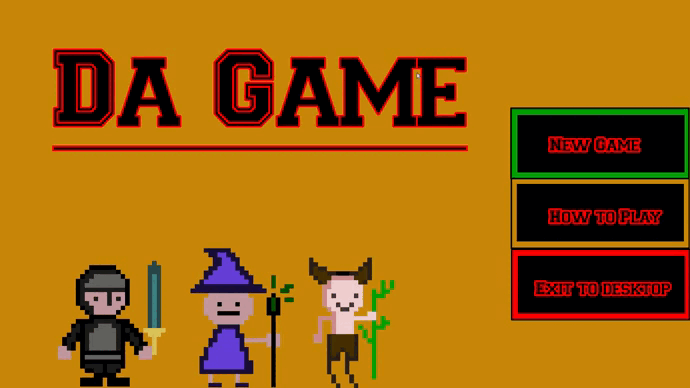
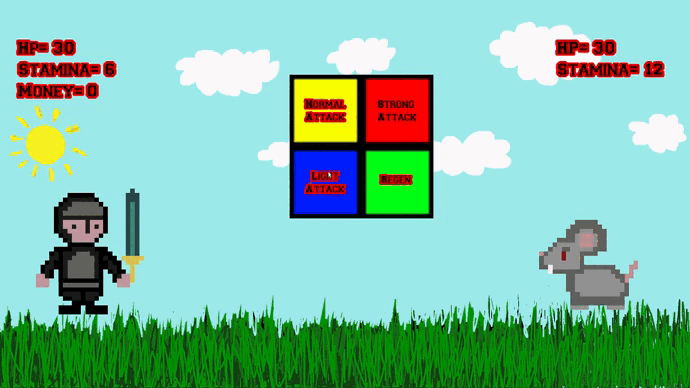
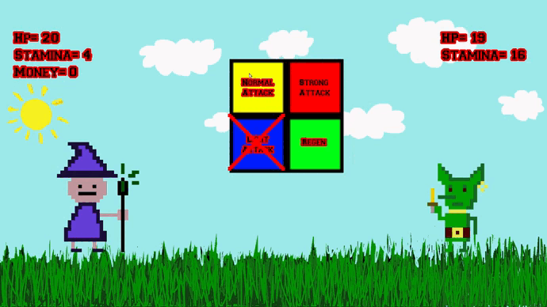
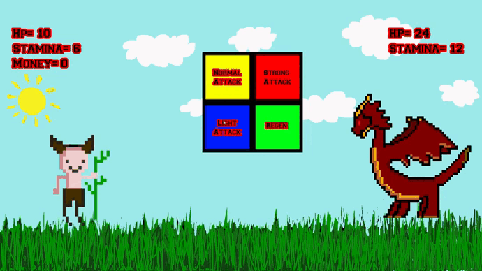
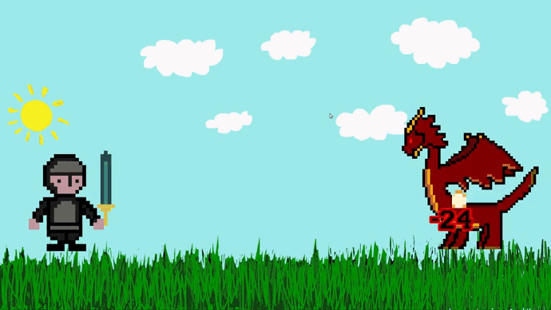
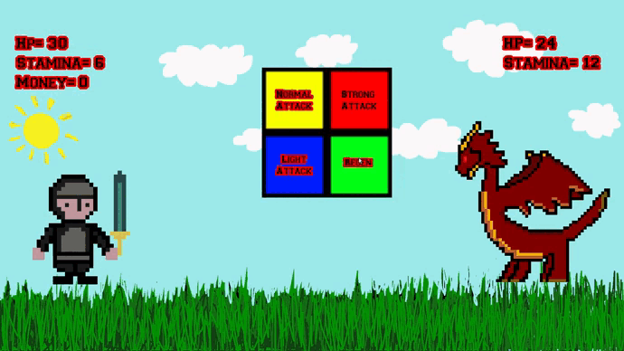
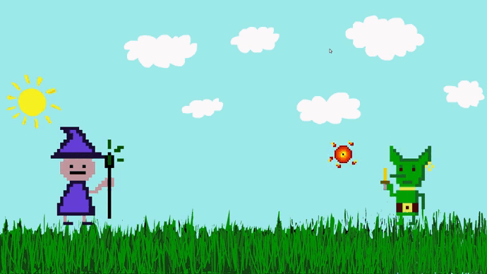

# Progetto di Programmazione

## Spiegazione GIoco

Il gioco è in stile rouge. il giocatore può scegliere tra tre classi: druid, mage e knight

Scelta la classe verrà creato un nemico. il giocatore potrà scegliere con quale attacco attacare o se ricaricare la stamina. Quando il giocatore attacca dovrà colpire dei bersagli chiamati **Ping**

<picture>

</picture>

# Eroi

Ogni eroe ha un oggetto speciale unico per la sua classe: per il mago è una staffa per incantesimi, per il druido un fiore e per il knight una spada

## Knight
Knight ha molto attacco e poca stamina

<picture>

</picture>

Attacco speciale:

ha una possibilità di fare un colpo critico

<picture>

</picture>

## Mage

Mage ha poco attacco ma molti ping

<picture>

</picture>

Attacco speciale:

dopo aver colpito 8 ping si potenzia e fa più danni

<picture>

</picture>

## Druid

Druid ha molta stamina ma poca vita

<picture>

</picture>

Attacco speciale:

dopo aver fatto un attacco leggero si trasforma e fa più danni

<picture>

</picture>

Esistono 3 tipi di attacchi:  
-attacco normale  
-attacco leggero( metà dei danni ma se vengono colpiti tutti i bersagli si può attaccare di nuovo)  
-attacco pesante(doppio dei danni ma solo se vengono colpiti tutti i bersagli)

Ucciso il nemico si è portati nella fase di loot dove il giocatore potrà scegliee un oggetto da portare con se che aumenta le statistiche. Se il cursore è sopra un oggetto apparirà scritto cosa potenzia.

Successivamente si passa alla fase di Shop dove se il giocatore avrà abbastanza soldi potrà comprare equipaggiamenti.

Infine si ha la scelta se potenziare o no una statistic tra Hp, Stamina o il numero di Ping.

<picture>

</picture>

# Nemici
I nemici sono un drago, un goblin e un topo

## Drago

Il drago ha molto attacco e spara palle di fuoco

<picture>

</picture>

## Ratto

Il ratto ha molta vita e morde

<picture>

</picture>

## Goblin

Il goblin ha molta stamina e invece di colpirti ti spezza il cuore

<picture>

</picture>

# Altre Feature

Nel gioco esiste un sistema di achivement. Attualmente gli unici achivemnt disponibili si sbloccano dopo aver ucciso 5 nemici e dopo aver fatto un attacco da più di 500 danni. un trofeo apparirà in basso a destra.

